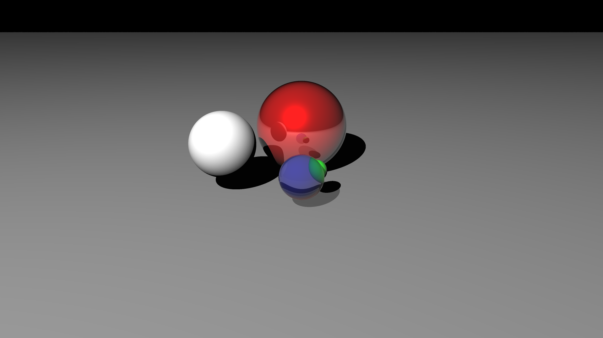

# Parallel Ray Tracer


## Compiling
Requires `nvcc` and `build-essential` (or equivalent)

+ `make` - Builds `raytracer` executable
+ `make run -- args...` - Builds and runs, equivalent to `make && ./raytracer args...`
+ `make debug` - Builds `raytracer` executable in debug configuration
+ `make gdb -- args...` - Runs a debug build with `gdb` for debugging (Requires `gdb`)
+ `make clean` - Removes generated files

You may need to make minor edits to [`./Makefile`](./Makefile) depending on your system.

## Usage
### Command Line
+ `./raytracer ?`/`./raytracer -h`/`./raytracer --help` - Prints help text and exits
+ `./raytracer config.json runtime.json` - Launches ray tracer REPL (order maters, names do not)

### REPL Commands
The program provides an input console so that you can move the camera and render the scene multiple times without having to restart the program.
+ `?`/`h`/`help` - Show help message
+ `q`/`quit`/`exit` - Exit REPL
+ `s`/`stat` - Show scene debug info
+ `r`/`run` - Render frame to `render.png`
+ `tp <x> <y> <z>` - Move the arcball camera to `x`, `y`, `z` (floats)

### Input File Format
The ray tracer needs two files to run: a [`./config.json`](./config.json) to specify the scene and a [`./runtime.json`](./runtime.json) to control optimizations and CPU vs. GPU.

#### [`./config.json`](./config.json):
```json
{
    "schema": "scene", 
    "resolution": [int, int]          (Default 1920x1080),
    "antialiasing": int               (Default 1, 2**(n+1) samples per pixel),
    "camera": {
        "pos": [float, float, float],
        "fov": float                  (Default 45, in degrees)
    },
    "scene": [
        {
            "type": "sphere",
            "pos": [float, float, float],
            "radius": float | "_dynamic", ("_dynamic" is animated)
            "material": {
                "diffuse": [float, float, float],
                "ambient": [float, float, float],
                "specular": [float, float, float],
                "shininess": float,
                "reflectivity": float,
                "refraction": float,
                "alpha": float
            }
        },
        {
            "type": "plane",
            "pos": [float, float, float],
            "normal": [float, float, float],
            "material": {
                ...
            }
        },
        {
            "type": "light",
            "pos": [float, float, float],
            "diffuse": [float, float, float],
            "ambient": [float, float, float],
            "specular": [float, float, float]
        },
        ...
    ]
}
```

#### [`./runtime.json`](./runtime.json):
```json
{
    "schema": "runtime",
    "target": "gpu" | "cpu" (Default "cpu"),
    "gpu_tweaks": {
        "block_width":       int (Default 16),
        "block_height":      int (Default 16),
        "partition_objects": bool (Default false),
        "buffer_objects":    bool (Default false),
        "layered":           bool (Default false)
    }
}
```

## Testing/Plotting Scripts
*See branch [`istanbul`](https://github.com/SteveBeeblebrox/Raytracer/tree/istanbul) for testing/plotting.*

+ `benchmark.html`
+ `benchmark_cpu_vs_gpu.html`
+ `benchmark_gpu_variants.html`
+ `benchmark_speedup.html`
+ `profile_cache.html`
+ `profile_dram.html`
+ `profile_fp32.html`
+ `profile_occupancy.html`
+ `profile_stalls.html`
+ `profile_time.html`

## Libraries
+ [`stb_image_write.h`](https://github.com/nothings/stb/blob/master/stb_image_write.h) - A public domain image library used to write raw bytes to a PNG output
+ [`f8.hpp`](./include/f8.hpp) - A PRNG library developed previously by Trin
+ [`json.hpp`](./include/json.hpp) - A JSON library developed previously by Trin
+ [`mm.hpp`](./include/mm.hpp) - A CUDA compatible `vec3` and math library developed by Trin